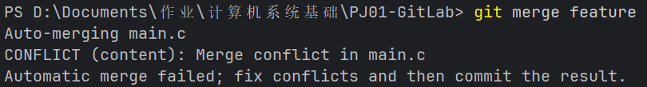
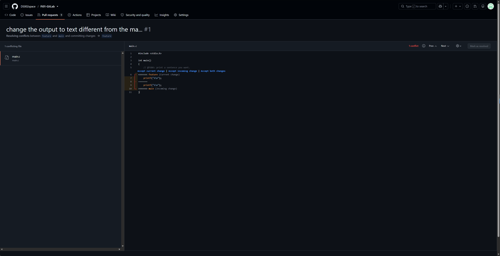
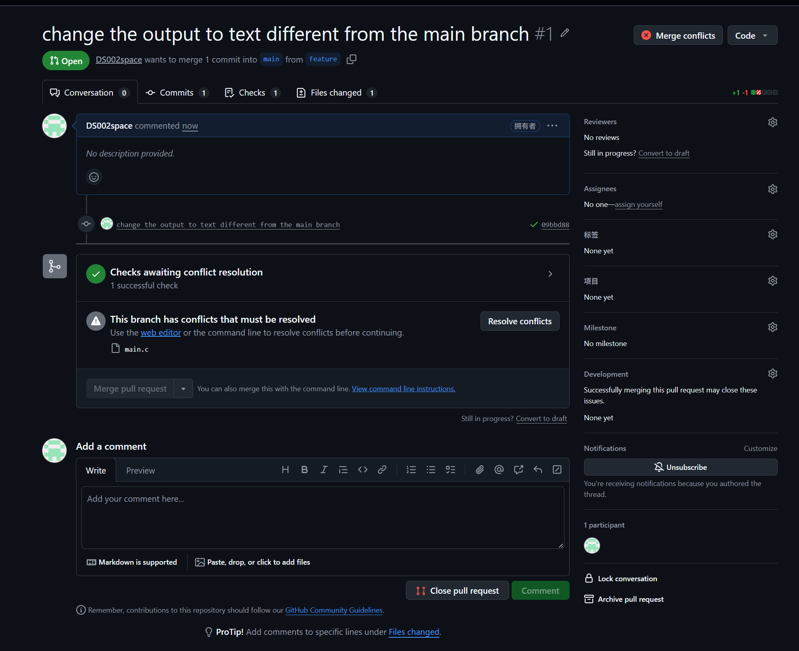

# Lab0：GitLab 实验报告

- 姓名：张琛岳
- 学号：25800190117
- 日期：2026-09-17

---

## 一

1.

有。我曾做过数据标注的工作，使用 Git 配合 GitCode 进行协作。在初期阶段，作为普通开发者，从main拉出自己的标注项目分支独立开发，完成后通过 Pull Request 发起合并，由其他成员进行 Code Review，确认无误后再合入主干；在晋升为项目维护者后，直接在main分支提交commit，并审查其他开发者提交的PR。如果出现合并冲突，说明多人标注了同一项目，在协商后在本地解决再推送。

### 2. 

1. 工作区里常常同时存在多组互不相关的修改，暂存区让我们能从中挑选逻辑相关的一组改动，使每次提交只表达一件事。
2. 提交前可检查，通过 `git diff --cached` 可以预览即将写入历史的完整内容，避免把调试代码、临时文件误提交。
4. 便于撤销。工作区、暂存区、仓库都有对应的撤销方式（`git restore`、`git restore --staged`、`git reset`），降低了误操作的成本。

### 3. 

- `git branch`：只列出本地分支，当前所在分支前面有 `*` 标记。
- `git branch -a`：列出所有分支，还包*远程跟踪分支。

本仓库实测结果：

```text
$ git branch
  feature
* main

$ git branch -a
  feature
* main
  remotes/origin/HEAD -> origin/main
  remotes/origin/feature
  remotes/origin/main
```

---

## 二

### 1. 建立个人仓库并克隆

```bash
git clone git@github.com:DS002space/PJ01-GitLab.git
cd PJ01-GitLab
```

### 2. 任务 2：修改 `main.c` 并提交

把 `main.c` 中 `@TODO` 处的输出由 `printf("Hello, world!\n");` 修改为 `printf("1\n");`，然后提交：

```bash
git add main.c
git commit -m "change print"
```

对应提交：`e9fd112 change print`。

### 3. 任务 4：新建 `feature` 分支并修改

```bash
git checkout -b feature
# 修改 main.c，把输出改为 printf("2\n");
git add main.c
git commit -m "change the output to text different from the main branch"
```

对应提交：`09bbd88`。

> `main` 与 `feature` 都从初始提交 `30853d5` 分叉，并且**修改了同一行代码**，因此合并时必然产生冲突。

### 4. 合并 `feature` 到 `main` 并解决冲突

切换回 `main` 后合并：

```bash
git checkout main
git merge feature
```

终端提示发生冲突：



编辑器中的冲突标记如下（`<<<<<<<` 到 `=======` 之间是 feature 的改动，`=======` 到 `>>>>>>>` 之间是 main 的改动）：



在 GitHub 上也能看到该合并请求提示存在冲突：



解决冲突：**保留 main 分支的版本**，手动删除所有冲突标记，使 `main.c` 恢复为：

```c
#include <stdio.h>

int main()
{
    // @TODO: print a sentence you want.
    printf("1\n");
}
```

然后完成提交：

```bash
git add main.c
git commit -m "Merge branch 'feature'"
```

对应合并提交：`21eba45 Merge branch 'feature'`。最后把两个分支推送到远程：

```bash
git push origin main
git push origin feature
```

### 5. 提交报告（任务 5）

将本报告 `report.md` 及截图（`img.png`、`img_1.png`、`img_2.png`）提交到 `main` 分支：

```bash
git add report.md img.png img_1.png img_2.png
git commit -m "add lab report"
git push origin main
```

---

## 三

### 1. Commit Message 规范（阮一峰）

文章推荐了一种常见的 Commit Message 格式：

```text
<type>(<scope>): <subject>
<空行>
<body>
<空行>
<footer>
```

- **type** 表示提交类型，常用的有：
  - `feat`：新增功能
  - `fix`：修复 bug
  - `docs`：文档修改
  - `style`：格式调整（不影响逻辑）
  - `refactor`：重构（既非新增功能也非修 bug）
  - `test`：测试相关
  - `chore`：构建过程或辅助工具的变动
- **scope** 表示影响范围（模块），**subject** 是简短描述（一般不超过 50 字，结尾不加句号）。
- **body** 说明改动的动机与实现细节，**footer** 用于关联 Issue（如 `Closes #12`）或标注不兼容变更（`BREAKING CHANGE`）。
- 核心目的：让每次提交**可读、可检索**，便于生成 Change Log、定位问题和代码回溯。

### 2. Git Flow 分支控制（及其分支模型）

Git Flow 提出了一套围绕发布的稳定分支模型，主要包含五类分支：

- **master / main**：只存放已发布（可上线）的版本，最稳定。
- **develop**：开发主干，汇集各功能分支的成果，是日常开发的集成分支。
- **feature/\***：从 `develop` 拉出，开发单个功能，完成后合并回 `develop`。
- **release/\***：从 `develop` 拉出，用于发布前的测试与修 bug，完成后同时合入 `master` 和 `develop`。
- **hotfix/\***：从 `master` 拉出，用于紧急修复线上问题，完成后同样合入 `master` 和 `develop`。

它的优点是职责清晰、发布流程规范，适合版本节奏明确的中大型项目；缺点是分支较多、流程相对繁琐，对持续交付/小团队来说可能偏重。

---

## 四、实验收获与建议

- 通过本次实验，熟悉了 `clone / add / commit / branch / checkout / merge / push` 的完整流程，并亲手处理了一次真实的合并冲突，理解了“**修改同一行会导致冲突**”这一现象。
- 解决冲突时的关键步骤：`git status` 确认冲突文件 → 打开文件删除 `<<<<<<< / ======= / >>>>>>>` 标记 → 保留需要的代码 → `git add` 标记已解决 → `git commit` 完成合并。
- 建议：
  1. 提交前养成先 `git status` / `git diff` 检查的习惯，避免把无关文件或误删文件一起提交。
  2. 项目应加入 `.gitignore`，忽略 `.idea/`、`.vscode/`、`*.exe` 等本地文件。
  3. 提交信息尽量遵循规范（如 `feat:`、`fix:`），方便日后检索与生成变更日志。
  4. 团队协作时优先使用功能分支 + Pull Request，并在合并前处理冲突，保持主干稳定。
